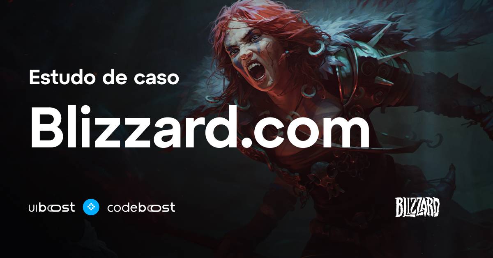

<h1 align="center">
    
</h1>

<h4 align="center"> 
	🚧 Landing Page - Blizzard 🚀 em construção... 🚧
</h4>

  

  

  
   

## 💻 Sobre o projeto

Projeto realizado no módulo de **Gulp.js** do curso Codeboost, projeto foi automatizado via gulp.js.

- **Gulp Sass:** Usado para compilar os arquivos **SASS** para **CSS**
- **Gulp Autoprefixer:** Adiciona automaticamente prefixos de CSS para garantir a compatibilidade com diferentes navegadores.
- **Gulp Watch:** Monitora mudanças nos arquivos do projeto e dispara tarefas de compilação ou outras tarefas sempre que um arquivo é alterado.
- **Gulp Concat:** Permite concatenar arquivos em um único arquivo, para reduzir o número de solicitações HTTP.
- **Gulp Babel:** Permite transpilar o código JavaScript ES6/ES2015 ou superior para uma versão mais antiga compativél pelos navegadores.
- **Gulp Uglify:** Usado para minificar o código JavaScript 
- **Gulp Browsersync:** Fornece um servidor local e sincronização em tempo real em diferentes dispositivos para o desenvolvimento web.

## 🎨 Layout

O layout da aplicação está disponível no Figma:

### Mobile

  

### Web

  

  

## 🛠 Tecnologias

As seguintes ferramentas foram usadas na construção do projeto:

- [Yarn][yarn]
- [Node.js][nodejs]
- [Gulp.js][gulpjs]
- [Javascript][js]

## 📝 Licença

Este projeto esta sobe a licença MIT.

Feito com ❤️ por Allan dos Reis  👋🏽 [Entre em contato!](https://www.linkedin.com/in/allan-dos-reis-535824207/)

[nodejs]: https://nodejs.org/
[yarn]: https://yarnpkg.com/
[vscode]: https://code.visualstudio.com/
[license]: https://opensource.org/licenses/MIT
[gulpjs]: https://gulpjs.com/
[js]: https://developer.mozilla.org/pt-BR/docs/Web/JavaScript